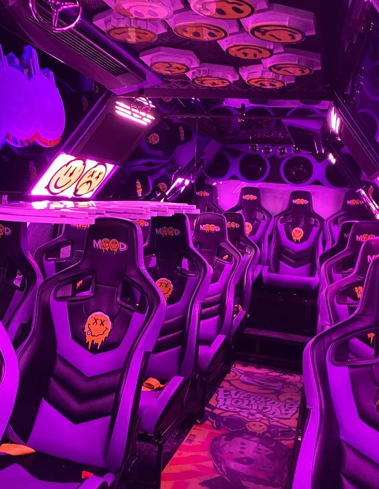
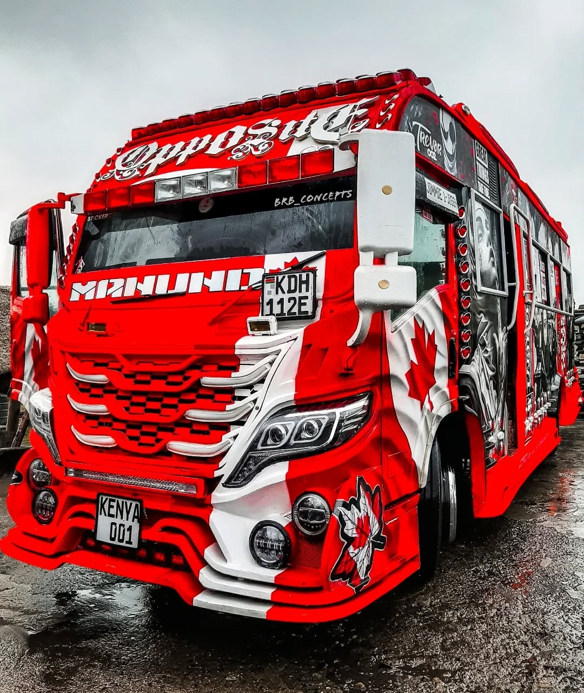
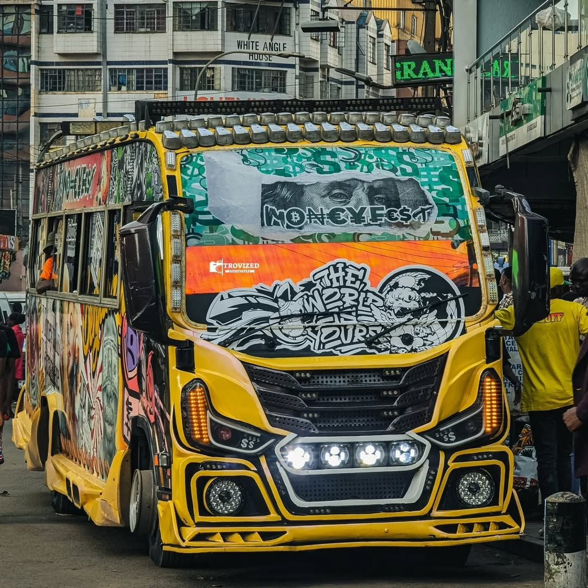

<html lang="en">
<head>
    <meta charset="UTF-8">
    <meta name="viewport" content="width=device-width, initial-scale=1.0">
    <title>MIC CHEQUE | Professional Storytelling</title>
    <!-- Classic Font Pairing: Playfair Display for headings, Lora for body, and Montserrat for accents -->
    <link href="https://fonts.googleapis.com/css2?family=Playfair+Display:ital,wght@0,400;0,700;1,400&family=Lora:ital,wght@0,400;0,700;1,400&family=Montserrat:wght@300;400;600&display=swap" rel="stylesheet">
    
</head>
<body>

    <header>
        

            
        

        <h1 class="site-title">MIC CHEQUE</h1>
        
The Art of the Untold Story

        
        <nav>
            <ul>
                <li><a href="#">Chronicles</a></li>
                <li><a href="#">The Vault</a></li>
                <li><a href="#">About the Mic</a></li>
                <li><a href="#">Contact</a></li>
            </ul>
        </nav>
    </header>

    <main>
        <!-- Story 1: Nairobi's Tech Hustle -->
        <article class="post">
            <h2 class="post-title">Nairobi’s Tech Hustle: From Small Rooms to Global Impact</h2>
            

                
In the modern heartbeat of Kenya, Nairobi has grown into one of Africa’s most influential innovation centers. What once looked like a city focused mainly on trade and administration is now home to fast-growing startups, digital creators, and software engineers shaping solutions for global markets.

                
This transformation did not happen overnight. It started in small internet cafés, university dorm rooms, and cramped rented apartments where young people experimented with code, design, and online business ideas. Many had no formal funding, no advanced equipment, and limited mentorship. What they had was curiosity and persistence.

                
                

                    
                

                
Today, those early experiments have evolved into real companies. Fintech platforms are now handling payments across East Africa. Logistics startups are improving delivery systems for small businesses. Health-tech tools are helping patients in remote areas access medical advice without traveling long distances.

                
A major driver of this growth is mobile technology. With widespread smartphone adoption and mobile money systems, developers have been able to build services that reach millions instantly. This has made Kenya one of the most advanced mobile-first economies in the world.

                

                    
                

                
However, the journey is still far from easy. Many startups struggle with funding gaps, especially at early stages. Others face infrastructure challenges such as inconsistent internet in certain areas or high operational costs. Competition is also intense, with hundreds of new ideas launched every year.

                
                

                    
                

                
Despite these challenges, the energy remains strong. Incubators and innovation hubs continue to support young talent. Universities are producing more tech graduates than ever before. International investors are increasingly paying attention to Nairobi as a serious tech destination.

                
What stands out most is the mindset shift. Young innovators are no longer waiting for jobs—they are building them. They are creating platforms that solve local problems while also competing globally. Nairobi is no longer just participating in the digital economy; it is actively shaping it.

                
                

                    
                

            

        </article>

        <!-- Story 2: Nairobi Matatu Culture -->
        <article class="post">
            <h2 class="post-title">Nairobi Matatu Culture: The Moving Art That Never Sleeps</h2>
            

                
In the fast-moving urban life of Kenya, few things define daily experience more vividly than the matatu system. These minibuses are not just a transport network—they are a living cultural phenomenon that blends art, music, economy, and street identity into one moving ecosystem.

                
Every matatu begins its identity long before it hits the road. Artists spend hours designing graffiti-style exteriors, often inspired by pop culture, local heroes, music icons, or social themes. Inside, the transformation continues with LED lights, high-powered sound systems, custom seats, and unique branding that makes each vehicle distinct.

                
                

                    
                

                
For passengers, stepping into a matatu is an experience of its own. Music fills the air, sometimes so loud it becomes part of the ride itself. Conductors call out destinations in fast, rhythmic chants that feel like performance poetry. Young people often see matatus as more than transport—they are social spaces where conversations, trends, and culture are exchanged.

                
                

                    
                

                
Behind this creativity is a crucial transport system that keeps Nairobi moving. Every day, millions of people rely on matatus to travel to work, school, markets, and hospitals. Without them, the city’s mobility would collapse under pressure.

                
                

                    
                

                
But the system operates in a complex environment. Traffic congestion in Nairobi is among the most challenging in the region, often causing long delays during peak hours. Route competition between operators can be intense, with each sacco trying to dominate popular routes. Regulations also evolve frequently, affecting pricing, design, and operation standards.

                
                

                    
                

                
Despite these issues, matatu culture continues to evolve rather than disappear. New designs appear regularly, each trying to push boundaries in creativity and style. The culture has even influenced fashion, music, and digital content creation, becoming a symbol of urban expression.

                
For outsiders, it may look chaotic. For locals, it is structured chaos with rhythm and identity. It represents survival, creativity, and movement all at once. Matatus are not just part of Nairobi—they are Nairobi in motion.

                
                

                    <video controls style="width:100%; max-width:800px;">
                        <source src="./matatu_culture_video.mp4" type="video/mp4">
                        Your browser does not support the video tag.
                    </video>
                

            

        </article>
    </main>

    <section class="subscription-section">
        <h2>Join the Inner Circle</h2>
        
Receive our weekly chronicles directly in your inbox.

        <form class="subscribe-form" onsubmit="event.preventDefault(); alert('Thank you for subscribing to MIC CHEQUE!');">
            <input type="email" placeholder="Your email address" required>
            <button type="submit">Subscribe</button>
        </form>
    </section>

    <footer>
        
NIKO KADI JE WEWE?

        
&copy; 2026 MIC CHEQUE. ALL RIGHTS RESERVED.

    </footer>

</body>
</html>
